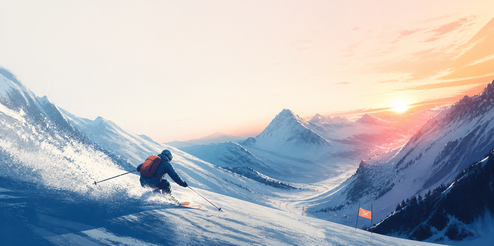

<div align="center">
  

  # Alpine Rush

  **A fast, responsive downhill arcade game built for the browser.**

  [Play now](https://skiyalatr.cyberducttape.com) · [Report a bug](https://github.com/itchyitchy123/ski_ya_l8tr/issues/new?template=bug_report.yml) · [Request a feature](https://github.com/itchyitchy123/ski_ya_l8tr/issues/new?template=feature_request.yml)

     
</div>

## About

Alpine Rush is a compact score-chasing ski game with an intentionally simple goal: stay on your feet, jump the pack, and push the pace as high as you can. It runs entirely in the browser with no framework, build step, or runtime dependencies.

## Music

The game soundtrack includes “The Copperhead Stomp (Official Release)” and “Highway Fever,” with random track selection by default. Players can choose a specific track or mute music from Settings. German mountain routes play “Tiroler Polka (Kloß mit Soß Remix)” automatically when Random track is selected.

### Highlights

- Momentum-based carving with keyboard and touch controls
- Five immediately playable Colorado mountain routes with unique weather, scenery, and hazard mixes
- Risk/reward jumps, near misses, flow combos, and daily objectives
- Dynamic difficulty, speed effects, camera banking, and brief impact slow-motion
- Persistent local high scores
- Four disciplines, persistent course medals, and personal-best ghost racing
- Gamepad, fullscreen, offline installation, graphics, motion, audio, and unit settings
- Unlockable jacket colors and score-based progression
- Responsive full-screen desktop and mobile presentation
- Pause, sound, reduced-motion, and automatic tab-blur handling
- Animated Canvas skiers, powder particles, ski trails, parallax scenery, and course objects

## Play

Visit **[skiyalatr.cyberducttape.com](https://skiyalatr.cyberducttape.com)** or run the game locally:

```bash
git clone https://github.com/itchyitchy123/ski_ya_l8tr.git
cd ski_ya_l8tr
python3 -m http.server 8080
```

Then open `http://localhost:8080`.

| Action | Keyboard | Touch |
| --- | --- | --- |
| Carve | `←` `→` or `A` `D` | Left/right buttons |
| Jump | `Space` | Jump button |
| Spin | `Q` / `E` | Spin button |
| Frontflip / backflip | Hold `W` / `S` in the air | Flip button |
| Safety grab | Hold `Shift` in the air | Grab button |
| Mountain boost | `X` when the meter is charged | Boost button |
| Brake / tuck | Hold `W` / `S` on snow | — |
| Pause | `P` or `Esc` | Pause button |

## Scoring

Your score increases while you stay on the mountain. Jumping obstacles, landing spins, backflips and safety grabs, linking alternating carves, and passing hazards at close range builds a flow multiplier and charges boost energy. Collect glowing energy pickups or reach 35% charge, then trigger a short high-speed Mountain Boost. Rotations must be completed before landing—a skier who comes down sideways will wipe out. Complete the rotating daily objective for a 1,000-point bonus.

The behind-the-skier chase camera keeps the skier facing and traveling downhill automatically. Carving is momentum-based: left and right set an edge to steer across the fall line, and a hard sustained carve scrubs some downhill speed. Releasing the control lets the skis flatten naturally. Airborne rotation also carries momentum, so counter-rotation and timing matter before landing.

## Colorado mountains

Echo Mountain in Idaho Springs is the default home mountain, while Eldora, Loveland Ski Area, Arapahoe Basin, and Steamboat are selectable from the first launch. Each route has dedicated scenic artwork built around recognizable local character: Echo's night lights and Front Range view, Eldora's wooded divide, Loveland's open bowls, A-Basin's rocky high-alpine wall, and Steamboat's rolling aspen terrain. Each is an original arcade interpretation; Alpine Rush is not affiliated with or endorsed by these ski areas.

Each resort offers selectable named downhill runs rather than an endless generic course. Runs have finite top-to-base distances, map-informed trail direction, width and pitch changes, terrain-specific tree lines, bowls, moguls, lift lines, park sections, and a finish area. The route roster includes Colorado mountains plus German home-country routes at Hausberg, Zugspitze, and Alpspitze. Echo's final approach includes an original slope-facing reconstruction of its lodge, patio, adjacent rental cabin, and chair terminal based on publicly available references. The geometry and buildings are game recreations, not navigational maps.

## Architecture

The project deliberately stays small and transparent:

```text
.
├── assets/              # Cover art and browser icon
├── .github/             # Issue and pull-request templates
├── tests/               # Dependency-free production smoke checks
├── index.html           # Semantic game shell and UI
├── styles.css           # Responsive visual system
├── game.js              # Course simulation and Canvas renderer
├── pro-systems.js       # Audio, settings, records, gamepad, and PWA systems
├── manifest.webmanifest # Install metadata
└── sw.js                # Offline asset cache
```

The renderer uses `requestAnimationFrame`; game movement is delta-time based, and the canvas scales for high-density displays. Player preferences and the best score stay in the browser through `localStorage`.

## Contributing

Bug reports, balancing ideas, accessibility improvements, and focused pull requests are welcome. Read [CONTRIBUTING.md](CONTRIBUTING.md) before opening a change. For security concerns, follow [SECURITY.md](SECURITY.md).

## Quality

Run `npm run check` before submitting a change. GitHub Actions runs the same JavaScript, manifest, and interface smoke checks for every pull request. Alpine Rush performs no analytics or tracking; preferences, medals, and ghost data remain local to the player's browser.

---

<div align="center"><sub>Built for one more run.</sub></div>
